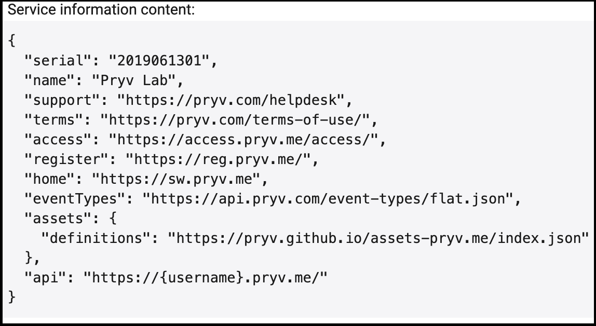

# Pryv.io onboarding tutorial

All you need to run this app is to download [index.html](index.html) and [script.js](script.js) files and open **index.html** with your browser.

This is an example application that performs the necessary calls that need to be implemented by a web application to onboard users on a Pryv.io platform. These calls are exposed (meaning they can be triggered from UI - index.html page) for the purpose of this example to emphasize the different steps of the process in a didactic fashion. In a real-life case, these API calls should be called automatically in the background upon page load.

The application allows the user to manually fetch the service information, displaying the retrieved data and where it is used. 
Next, it allows to perform the authentication by loading the button that opens the sign in / user creation pop up.  
Finally, it displays the obtained API endpoint that can be used to make API calls to the Pryv.io platform whose service information you loaded. 

## Service information

For this application, we have used the [Pryv JavaScript library](), loading it for [the browser](https://github.com/pryv/lib-js#browser) as following:

```html
<script src="https://api.pryv.com/lib-js/pryv.js"></script>
```

In your application, you will need to fetch the [service information](https://api.pryv.com/reference/#service-info) as the first call of most of your apps working with a Pryv.io platform. It allows to obtain information such as the API endpoint format or the authentication request URL. Using it in your apps allows you to make them interoperable between Pryv.io platforms which is useful when working with production and staging environments.

### Define URL


In this example, the service information block allows to define the service information you will fetch from a list of editable preset values.

```html
<select name="service-info-select" id="service-info-select">
  <optgroup label="Open Pryv.io">
    <option value="https://my-computer.rec.la:4443/reg/service/info">Dev rec-la SSL</option>
    <option value="http://localhost:3000/reg/service/info">Dev localhost</option>
    <option value="https://{HOSTNAME}/reg/service/info">Your own hostname</option>
  </optgroup>
  <optgroup label="Pryv.io">
    <option value="https://reg.pryv.me/service/info" selected="selected">Pryv Lab</option>
    <option value="https://reg.{DOMAIN}/service/info">Your own domain</option>
  </optgroup>
</select>
<div class="form-group">
  <label for="service-info">Service Information URL:</label>
  <input type="text" class="form-control" id="service-info-text" value="https://reg.pryv.me/service/info" />
</div>
```

### Retrieve resource

Once you have chosen your service information URL, you can load it using the following button:

```html
<button 
  type="button"
  id="fetch-service-info-button"
  class="btn btn-primary mb-2">Fetch service info</button>
<br>
```

```javascript
async function fetchServiceInfo() {
  service = new Pryv.Service(serviceInfoInput.value);
  service = await service.info();
  // ...
}
```

The server response is displayed below:



### Customize message

We use these fields to customize the welcome message:

```html
<h2 class="card-title" id="service-name">PLATFORM NAME</h2>
Welcome ! <br>
You can sign in or create an account on this Pryv.io platform to save your crawl stroke performance. <br><br>

Here are the links for:<br>
<ul>
  <li>Terms and conditions: <a href="" id="service-terms">PLATFORM TERMS</a></li>
  <li>Support: <a href="" id="service-support">SERVICE-SUPPORT</a></li>
  <li>Homepage: <a href="" id="service-home">SERVICE-HOMEPAGE</a></li>
</ul>
```

```javascript
async function fetchServiceInfo() {
  // ..
  serviceName.innerHTML = service.name;
  serviceTerms.innerHTML = service.terms;
  serviceTerms.href = service.terms;
  serviceHome.innerHTML = service.home;
  serviceHome.href = service.home;
  serviceSupport.innerHTML = service.support;
  serviceSupport.href = service.support;
}
```

Placeholder screen:


Customized screen:


## Authentication request

Once the service information is fetched and its values displayed, we can initiate the authentication process. As shown here, we display the URL for the authentication request API call, which was retrieved in the service information:


Here again, we perform it by manually pressing a button, which will load the [lib-js login button](https://github.com/pryv/lib-js#within-a-webpage-with-a-login-button).


### Sign in / create account

We add the following element in the HTML page where the button will appear once loaded:

```html
<span id="pryv-button"></span>
```

The [auth request parameters](https://api.pryv.com/reference/#auth-request) and callback are defined in the separate [script.js](script.js) file:

```javascript
let connection = null;

async function authRequest() {
  Pryv.Browser.setupAuth(authSettings, serviceInfoInput.value);
}

const authSettings = {
  spanButtonID: 'pryv-button', 
  onStateChange: pryvAuthStateChange, 
  authRequest: { 
    requestingAppId: 'pryv-onboarding', 
    requestedPermissions: [ 
      {
        streamId: 'health',
        defaultName: 'Health',
        level: 'manage' 
      }
    ],
    clientData: {
      'app-web-auth:description': {
        'type': 'note/txt',
        'content': 'This sample app demonstrates how to implement an onboarding experience.'
      }
    },
  }
};

function pryvAuthStateChange(state) {
  console.log('##pryvAuthStateChange', state);
  if (state.id === Pryv.Browser.AuthStates.AUTHORIZED) {
    apiEndpointText.innerHTML = state.apiEndpoint;
    apiEndpointDiv.style.visibility = 'visible';

    // Normally you would create a connection object and do something with the data here.
    //connection = new Pryv.Connection(state.apiEndpoint);
  }
  if (state.id === Pryv.Browser.AuthStates.INITIALIZED) {
    connection = null;
  }
}
```

### API endpoint

Once the user has created an account and authenticated himself, you will receive an API endpoint which you can use to perform API calls on his account.


